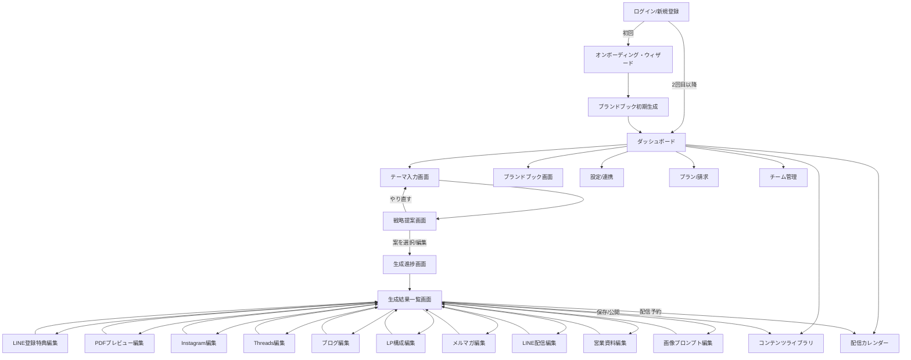
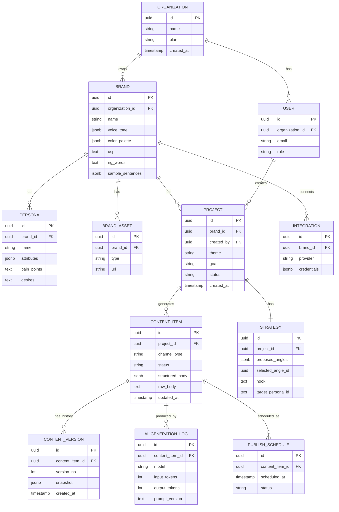
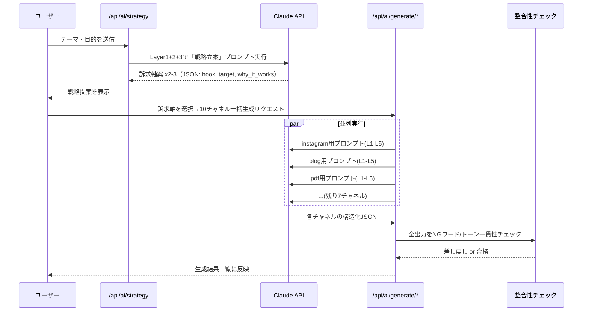

# マダナイ？ 設計書

> 「まだない？」を「もうある。」へ。
> AIを「マーケティング担当者」として雇う、というプロダクト思想の設計書。

**バージョン**: v0.1（初版・実装着手前のレビュー用）
**対象読者**: プロダクトオーナー、開発チーム
**ステータス**: 承認待ち（この設計書の承認後、Issueに分割して1機能ずつ実装する）

---

## 0. プロダクトの本質定義（最初に合意すべきこと）

このシステムは「文章生成ツール」ではなく、**中小企業・個人事業主のために働く、AIマーケティング担当者**である。この前提が全ての画面設計・API設計・UI文言に影響するため、最初に明文化する。

| 単なるAIチャット型ツール | マダナイ？ |
|---|---|
| ユーザーが指示を書く | AIが「テーマ」から戦略を提案する |
| 1つのテキストボックスに1回answer | 1つのテーマから10種類の成果物が連動して生まれる |
| 生成して終わり | ブランドの一貫性・訴求軸が全チャネルで揃う |
| ツールとの対話 | 「担当者に相談する」体験 |
| 出力＝ゴール | 出力＝集客〜契約導線の一部（次のアクションに繋がる） |

したがって、生成フローには必ず**「戦略立案ステップ」**を挟む（詳細は7章）。いきなり文章を出さない。人間のマーケ担当者が「テーマ」を受け取ったら、まず訴求軸・ターゲット心理・切り口を考えるのと同じ思考プロセスをAIにやらせ、ユーザーに提案・選択させてから初めて各コンテンツを生成する。

**設計上の前提（要確認）**: データモデルは「1組織が複数ブランド（＝複数クライアント）を管理できる」構造にしている。これは (a) マダナイ社内スタッフが複数の中小企業クライアントの代行運用をするエージェンシー型利用と、(b) 将来、中小企業自身がセルフサーブで契約するSaaS型利用の両方に対応するため。単一ブランド運用しか想定しない場合はデータモデルを簡略化できるが、将来の拡張コストを考えると複数ブランド対応を最初から入れることを推奨する。

---

## ① 必要な画面一覧

MVP範囲は「⑫ MVP」章、フェーズ分けは「⑪ 開発優先順位」章を参照。

### A. 認証・オンボーディング
1. **ログイン/新規登録** — メール or Google認証
2. **オンボーディング・ウィザード**（初回のみ）— 会社名、業種、商品/サービス、ターゲット顧客、トーン&マナー、ロゴ・カラーを対話形式で入力しブランドブックの初期版を自動生成

### B. ホーム
3. **ダッシュボード** — 直近の生成物、進行中プロジェクト、今日やるべきこと（LINE配信予定、投稿予定）、AIからの提案（「そろそろ新しいテーマで発信しませんか？」等）

### C. ブランド管理
4. **ブランドブック画面** — ブランドボイス、ペルソナ、USP、NGワード、トーンスライダー、参考文章（few-shot例文）
5. **ペルソナ管理画面** — 複数ターゲット像の作成・編集
6. **ブランドアセット画面** — ロゴ・配色・フォント・過去実績/お客様の声のアップロード

### D. コンテンツ生成（コア体験）
7. **テーマ入力画面**（「AIマーケ会議室」）— お題・目的（集客/販売/認知/採用等）・使いたいチャネルを選択
8. **戦略提案画面** — AIが2〜3案の訴求軸（切り口・フック・想定ペルソナ）を提示し、ユーザーが選択 or 微調整
9. **生成進捗画面** — 10種類のコンテンツが並行生成される様子をステップ表示（安心感の演出）
10. **生成結果一覧画面** — タブ/カードで10種類の成果物を横断表示、ステータス（完成/要編集/未生成）
11. **個別コンテンツ編集画面**（チャネル別、共通レイアウト＋専用プレビュー）
    - LINE登録特典テキスト
    - PDF（特典/資料）デザインプレビュー編集
    - Instagram投稿（画像プロンプト付き）
    - Threads投稿
    - ブログ記事（SEO要素付き）
    - LP構成（セクションごとの構成案）
    - メルマガ
    - LINE配信文
    - 営業資料（商談用スライド構成）
    - 画像生成プロンプト集

### E. 資産管理・活用
12. **PDFプレビュー/デザイン選択画面** — テンプレート選択、ブランドカラー自動適用、ダウンロード
13. **画像プロンプト＆ギャラリー画面** — 生成プロンプトのコピー、（将来）画像生成API連携結果の管理
14. **コンテンツライブラリ** — 過去の全生成物を横断検索・フィルタ（チャネル別/テーマ別/日付別）
15. **公開・配信カレンダー**（Phase後半） — SNS投稿予定、LINE配信予定を可視化

### F. 成果・運用（将来拡張、設計だけ用意）
16. **成果分析ダッシュボード** — 開封率/CTR/反応（Phase後半〜将来）
17. **チーム/権限管理画面** — メンバー招待、ロール（管理者/編集者/閲覧者）
18. **プラン・請求画面** — Stripeサブスクリプション管理
19. **設定画面** — LINE公式アカウント連携、Instagram/Threads連携、通知設定
20. **ヘルプ/使い方ガイド** — 初心者向けチュートリアル、用語解説

---

## ② 画面遷移



**設計意図**:
- 「テーマ入力 → 戦略提案 → 生成 → 編集 → 公開」を**一本道のウィザード**にし、迷わせない（Notion的なシンプルさ）。
- 個別編集画面はすべて「生成結果一覧」に戻ってくる放射状構造にすることで、10種類の中を行き来してもユーザーが迷子にならない。
- ダッシュボードを常にホームベースにし、どの画面からも1クリックで戻れる（グローバルナビはApple/Notion同様に最小限＋左サイドバー固定）。

---

## ③ データ構造

### ER図（主要エンティティ）



### `channel_type`（enum）
```
line_incentive | pdf_lead_magnet | instagram_post | threads_post |
blog_article | lp_structure | newsletter | line_broadcast |
sales_document | image_prompt
```

### ブランドブックのJSON構造例（`brand.voice_tone`）
```json
{
  "tone_sliders": {
    "formal_casual": 35,
    "logical_emotional": 60,
    "expert_friendly": 45
  },
  "keywords": ["信頼できる", "伴走する", "専門的だけど親しみやすい"],
  "ng_words": ["絶対", "誰でも簡単に稼げる", "最安"],
  "sample_sentences": [
    "私たちはホームページ制作会社ではありません。集客・売上・業務効率化まで支援する会社です。"
  ],
  "cta_style": "断定しすぎず、次の一歩を軽くする"
}
```

### コンテンツアイテムの構造例（`content_item.structured_body`、LP構成の場合）
```json
{
  "sections": [
    { "type": "hero", "headline": "...", "subcopy": "...", "cta": "..." },
    { "type": "problem", "body": "..." },
    { "type": "solution", "body": "..." },
    { "type": "proof", "items": ["..."] },
    { "type": "offer", "body": "..." },
    { "type": "faq", "items": [{ "q": "...", "a": "..." }] },
    { "type": "final_cta", "body": "..." }
  ]
}
```

構造化データ（sections配列など）で保持するのは、**PDF/LP/メール等、複数チャネルへの再レンダリングを可能にするため**。ベタなraw_bodyだけだと後からデザインテンプレートに流し込めない。

---

## ④ フォルダ構成

Next.js（App Router）+ TypeScriptのモノレポ構成を推奨（後述⑤の技術選定と対応）。

```
madanai-contentsAI/
├── apps/
│   └── web/                          # Next.js アプリ本体（フロント+API Route）
│       ├── app/
│       │   ├── (auth)/
│       │   │   ├── login/
│       │   │   └── onboarding/
│       │   ├── (dashboard)/
│       │   │   ├── dashboard/
│       │   │   ├── brand/            # ブランドブック管理
│       │   │   ├── projects/
│       │   │   │   ├── new/          # テーマ入力
│       │   │   │   └── [projectId]/
│       │   │   │       ├── strategy/
│       │   │   │       ├── generating/
│       │   │   │       └── results/
│       │   │   │           └── [channelType]/  # 個別編集画面
│       │   │   ├── library/
│       │   │   ├── calendar/
│       │   │   ├── settings/
│       │   │   └── billing/
│       │   └── api/
│       │       ├── ai/
│       │       │   ├── strategy/route.ts
│       │       │   └── generate/[channelType]/route.ts
│       │       ├── pdf/render/route.ts
│       │       ├── webhooks/
│       │       │   ├── stripe/route.ts
│       │       │   └── line/route.ts
│       │       └── integrations/
│       ├── components/
│       │   ├── ui/                   # shadcn/uiベースの基礎コンポーネント
│       │   ├── brand/
│       │   ├── content-editor/
│       │   └── generation/
│       └── lib/
│
├── packages/
│   ├── db/                           # Prisma schema + client
│   │   ├── schema.prisma
│   │   └── seed.ts
│   ├── ai/                           # Claude API呼び出しロジック
│   │   ├── client.ts
│   │   ├── prompts/
│   │   │   ├── strategy.ts
│   │   │   ├── channels/
│   │   │   │   ├── instagram.ts
│   │   │   │   ├── blog.ts
│   │   │   │   ├── lp.ts
│   │   │   │   └── ...
│   │   │   └── brand-context.ts
│   │   └── schemas/                  # 各channel_typeの構造化出力用JSON Schema
│   ├── pdf/                          # PDFテンプレート & レンダラー
│   │   ├── templates/
│   │   │   ├── lead-magnet.tsx
│   │   │   └── sales-doc.tsx
│   │   └── renderer.ts
│   ├── ui/                           # 共有デザインシステム（トークン・原子コンポーネント）
│   │   ├── tokens.ts                 # カラー/スペーシング/タイポグラフィ
│   │   └── components/
│   └── config/                       # ESLint/TSConfig共有設定
│
├── docs/
│   ├── DESIGN.md                     # 本ファイル
│   └── decisions/                    # ADR（設計判断記録）
│
├── turbo.json
├── package.json
└── README.md
```

**設計意図**: `packages/ai` にプロンプト設計を集約することで、「AIマーケ担当者としての人格・専門知識」がコードベース上でも1箇所に集中管理される。チャネルが増えても`prompts/channels/`にファイルを追加するだけで拡張できる。

---

## ⑤ 技術スタック

| レイヤー | 選定 | 理由 |
|---|---|---|
| フロントエンド | Next.js 15 (App Router) + TypeScript | SSR/RSCでSEOブログにも強く、フルスタックで開発速度が出る |
| UI | Tailwind CSS + shadcn/ui + Framer Motion | ブランドトークンをTailwind configに注入しやすい。Notion的な洗練されたUIをゼロから作りやすい |
| フォーム/バリデーション | React Hook Form + Zod | Claude APIへの構造化出力スキーマとZodを共有できる |
| API層 | Next.js Route Handlers（＋tRPC検討） | 初期はRoute Handlersでシンプルに、型安全性が課題になったらtRPC導入 |
| DB | PostgreSQL（Supabase） | 構造化JSON(jsonb)を多用するため相性が良い。Auth/Storageも同一プラットフォームで完結 |
| ORM | Prisma | スキーマ駆動でマイグレーション管理がしやすい |
| 認証 | Supabase Auth（または Clerk） | メール/Google認証、組織（マルチテナント）対応が容易 |
| ストレージ | Supabase Storage（S3互換） | ロゴ、生成画像、PDF成果物の保存 |
| AI | Anthropic Claude API（Sonnet系を主力） | 長文・構造化出力・プロンプトキャッシュに強く、日本語のトーン制御品質が高い |
| ジョブ実行 | Vercel Background Functions / Inngest | 10種のコンテンツを並列生成するための非同期処理 |
| PDF生成 | Puppeteer（HTML/CSSテンプレート）or React-pdf | ブランドデザイン（グラデーション等）を忠実に再現できるHTML+Puppeteerを優先（詳細⑧） |
| 決済 | Stripe | JPYサブスクリプション対応、日本市場で実績あり |
| 外部連携（将来） | LINE Messaging API, Instagram Graph API, Threads API | 生成→配信までの自動化 |
| ホスティング | Vercel | Next.jsとの親和性、プレビューデプロイでの検証速度 |
| 分析（将来） | PostHog | プロダクト内行動分析、将来の成果分析ダッシュボードの元データ |
| モノレポ管理 | Turborepo | packages/aiやpackages/uiを複数アプリ（将来の管理画面分離等）で共有可能に |

---

## ⑥ コンポーネント設計

### デザイントークン（`packages/ui/tokens.ts`）
ブランドの「白背景・黒文字・ピンク〜紫グラデーション・Appleの余白・Notionの使いやすさ」を数値化してコード資産にする（詳細は⑭）。

### 主要コンポーネント一覧

| コンポーネント | 役割 | 備考 |
|---|---|---|
| `<ThemeInputCard>` | テーマ入力画面の中心UI。テーマ・目的・チャネル選択 | 入力例のプレースホルダーをAI初心者向けに具体的に出す |
| `<StrategyAngleCard>` | AIが提案する訴求軸カード（2〜3枚並列） | 「なぜこの切り口が効くか」の一言解説を必ず添える（信頼構築） |
| `<GenerationStepper>` | 10チャネル生成の進捗を可視化 | 完了ごとにチェックが付き、"待たされている感"を減らす |
| `<ContentTypeTabs>` | 結果一覧のチャネル別タブ/カード切替 | アイコン+ステータスバッジ |
| `<ContentEditorPanel>` | 個別編集の共通シェル（左：プレビュー／右：編集＋AI再生成ボタン） | 全チャネル共通の骨格、中身は`channel-specific`コンポーネントを差し込む |
| `<ToneRegenerateButton>` | 「もっとカジュアルに」「もっと専門的に」等ワンクリック再生成 | マーケ担当者っぽい"提案の幅"を出すUI |
| `<BrandVoicePanel>` | ブランドブック編集の中心UI | スライダー+タグ入力+サンプル文章 |
| `<PersonaCard>` | ペルソナ表示・編集 | 顔アイコン風のイラスト+属性リスト |
| `<PDFPreviewFrame>` | PDFテンプレートのライブプレビュー(iframe) | テンプレート切替時に即時反映 |
| `<PublishScheduleCalendar>` | 配信カレンダー | Phase後半 |
| `<StatusBadge>` | 生成ステータス（未生成/生成中/要確認/完成） | 色分けはグラデーションではなく彩度低めのソリッドカラーで視認性優先 |
| `<AIRationaleTooltip>` | AIの提案根拠を一言表示するツールチップ | 「なぜこの文言か」を常に説明可能にし、AI初心者の不安を解消 |

**設計方針**: 個別編集画面はチャネルごとに見た目が違うが、**骨格（左プレビュー／右編集／上部にAI再生成コントロール）は完全共通**にする。Notionのブロック編集のように「操作を覚えたら全チャネルで使い回せる」ことを最優先する。

---

## ⑦ Claude API設計

ここが「マーケ担当者化」の核心。単発プロンプトでは実現できないため、**多段パイプライン**で設計する。

### レイヤー構造（システムプロンプトの合成）

```
Layer 1: AIペルソナ層（固定）
  「あなたは中小企業の専属マーケティング担当者として15年の実務経験を持つ。
   セールスコピー、ブランディング、心理学的トリガーに精通している。
   単なる文章生成ではなく、事業成果（集客・契約）に責任を持つ立場で考える。」

Layer 2: ブランドコンテキスト層（brand単位でキャッシュ）
  ブランドブックJSON全体（voice_tone, USP, ng_words, sample_sentences）
  → prompt caching対象（同一プロジェクト内の全生成で使い回す＝コスト・速度最適化）

Layer 3: ペルソナ/戦略層（project単位）
  選択済みのペルソナ、選択済みの訴求軸（hook）、目的（goal）

Layer 4: チャネル専門知識層（channel_type単位）
  例）Instagram: 「保存されたくなる投稿の型」「1枚目3秒で離脱させない構成」
      LP: 「PASONA/AIDCAS等のセクション構成」「オファーの見せ方」
      ブログ: 「SEOタイトルの型」「E-E-A-Tを意識した構成」
      営業資料: 「意思決定者が納得する課題→解決→実績→比較→提案の流れ」

Layer 5: 出力フォーマット層
  Tool useによるJSON Schema強制（channel_typeごとに構造を固定）
```

### 生成フロー（2段階生成 + 検証）



### モデル選定方針
- **戦略立案ステップ**: 最も品質が結果を左右するため上位モデル（Claude Opus/Sonnet）を使用
- **チャネル別生成**: Claude Sonnetを標準。トークン量が少ない単純変換（例：ブログ→Instagramキャプション要約）は将来Haiku等の軽量モデルへのフォールバックでコスト最適化を検討
- **整合性チェック**: 軽量モデルで「NGワード検出」「ブランドトーンからの逸脱検知」を実施

### プロンプトキャッシュ戦略
- Layer1（AIペルソナ）+ Layer2（ブランドブック）は**ブランド単位でキャッシュブロック化**。同一ブランドの複数プロジェクト・複数チャネル生成で毎回同じプレフィックスを送ることになるため、Anthropicのprompt cachingでコスト・レイテンシを大幅に削減する。
- チャネル専門知識（Layer4）も静的テキストなので合わせてキャッシュ対象にする。

### 構造化出力
各`channel_type`ごとにZodスキーマ（`packages/ai/schemas/`）を定義し、Claudeのtool use（強制JSON出力）で受け取る。これによりPDFレンダラーやLPプレビューへの流し込みが型安全に行える。

### バージョニング
`ai_generation_log.prompt_version` にプロンプトテンプレートのバージョンを記録。プロンプト改善時に旧生成物との比較・A/Bテストができるようにする。

---

## ⑧ PDF生成方法

**推奨方式: HTML/CSSテンプレート + Puppeteer（サーバーサイドヘッドレスブラウザ）でPDFレンダリング**

理由:
- ブランドのグラデーション、余白、フォント（Noto Sans JP等）を**Webと全く同じCSSで再現**できる。React-pdfは表現力に制約があり、「高級感のあるデザイン」を再現しにくい。
- `packages/pdf/templates/`にReactコンポーネントとしてPDFテンプレート（特典PDF用、営業資料用など複数種）を用意し、`content_item.structured_body`のJSONを流し込んでHTMLレンダリング→Puppeteerでprint-to-PDFする。
- サーバーレス環境でのPuppeteer実行コストが課題になった場合は、`@sparticuz/chromium`等の軽量Chromiumバイナリを利用、またはPDF生成専用のワーカー（Node常駐プロセス or Cloud Run）に切り出す。

**将来のスケール最適化（Phase後半で検討）**:
- Satori（Vercel OG image生成で使われるSVGレンダラー）+ resvg-jsの組み合わせで、ヘッドレスブラウザなしの高速PDF/画像生成に移行可能。ただし複雑なレイアウト表現力はPuppeteerに劣るため、テンプレートが固まってから移行判断する。

**テンプレート設計**:
- 表紙・見出し・本文ブロック・CTAブロック・フッターを部品化し、`structured_body.sections`から自動組版。
- ブランドの`color_palette`・ロゴを自動適用し、ユーザーは「テンプレートを選ぶだけ」でデザイン作業不要にする（ノーコード前提のターゲット層のため）。

---

## ⑨ ブランド情報の管理方法

「ブランドブック」を**唯一の真実源（Single Source of Truth）**として設計する。これが全チャネルの一貫性を保証する、このプロダクトの最重要資産。

### 管理項目
1. **基本情報**: サービス名、コンセプト、業種、商品/サービス概要
2. **トーン&マナー**: スライダー（フォーマル⇄カジュアル、論理⇄感情、専門的⇄親しみやすい）＋自由記述キーワード
3. **NGワード/表現**: 薬機法・景表法等のリスク表現、企業として避けたい言い回し
4. **USP（独自の強み）**: 競合と何が違うか（例：「HP制作会社ではなく、集客〜業務効率化まで伴走する」）
5. **サンプル文章（few-shot例）**: 過去の「良い」文章を登録し、生成時にスタイル模写の参照にする
6. **ペルソナ（複数可）**: ターゲットごとの悩み・欲求・行動特性
7. **ビジュアルアセット**: ロゴ、カラーパレット、フォント、実績写真/お客様の声

### 反映の仕組み
- ブランドブックは⑦のLayer2としてキャッシュ済みプロンプトブロックに変換され、**全生成物に自動反映**される。ユーザーが個別チャネルごとにトーンを指定し直す必要がない。
- ブランドブックを更新すると、以後の新規生成にのみ反映（過去生成物は`content_version`で履歴保持、勝手に書き換えない）。
- 将来的にエージェンシー利用（1組織が複数クライアントを管理）する場合、ブランドごとに独立したブランドブックを持たせ、プロジェクト作成時にどのブランドで生成するか選択させる。

---

## ⑩ 将来追加できる機能

優先度が低い順ではなく、拡張の方向性別に整理。

**配信・自動化**
- LINE公式アカウントAPI連携による登録特典の自動配布・LINE配信の自動送信
- Instagram/Threads投稿の予約自動投稿（Graph API連携）
- メルマガのESP連携（配信スタンダード等）

**AIの高度化**
- 画像生成AI直接連携（Flux, Midjourney API, Stable Diffusion）でプロンプトだけでなく画像そのものを生成
- 動画台本→AIアバター動画生成（Reels/TikTok想定）
- 音声/ポッドキャスト台本生成
- A/Bテスト機能（同じ訴求軸から複数バリエーションを生成し配信後の反応を比較）
- 生成物のパフォーマンスフィードバックをAIに学習させ、次回提案の精度を上げる（ブランドごとの「勝ちパターン」蓄積）

**分析・成果可視化**
- 開封率/CTR/コンバージョンのダッシュボード
- 「このLPは平均より契約率が高い」等のベンチマーク提示

**業務効率化**
- CRM連携（見込み客管理、商談履歴）
- 営業資料から提案書・見積書・簡易契約書への自動展開
- LINE上でのAI一次対応（チャットボット化）

**事業拡張**
- 業種別テンプレートライブラリ（美容室/飲食店/士業など業種特化の型）
- 多言語対応（インバウンド需要のある店舗向け）
- チーム/代理店向けマルチブランド管理の本格化
- ホワイトレーベル化（他の制作会社・代理店へのOEM提供）

---

## ⑪ 開発優先順位

| Phase | 内容 | ゴール |
|---|---|---|
| **Phase 0** | 認証、組織/ブランドの基本データモデル、ブランドブック作成ウィザード | ユーザーが自社の情報を登録できる |
| **Phase 1（MVP）** | テーマ入力→AI戦略提案→**4大成果物**（LINE登録特典 / PDF / SNS投稿(Instagram+Threads) / ブログ記事）を一括生成→編集→ダウンロード/コピー | 「最終目標」で語られたPDF・LINE・SNS・ブログの核が1クリックで完成する体験を証明する |
| **Phase 2** | LP構成、メルマガ、LINE配信文、営業資料、画像生成プロンプトを追加し10種フル対応 | 全チャネルカバー、コンテンツライブラリ実装 |
| **Phase 3** | 配信カレンダー、PDFテンプレート複数化、ブランド整合性チェッカーの精度向上 | 運用効率化 |
| **Phase 4** | LINE/Instagram/Threads外部API連携による自動配信 | 生成→配信までワンストップ化 |
| **Phase 5** | 成果分析ダッシュボード、A/Bテスト、複数ブランド管理の本格化、チーム機能 | データドリブンな改善サイクルとエージェンシー利用への対応 |

---

## ⑫ MVP定義

ユーザーの掲げた「最終目標」（テーマ入力→ワンクリックでPDF・LINE・SNS・ブログが完成する）を、そのまま**最小の完全な価値**としてMVPスコープに採用する。

### MVPに含む
- 認証（メールログインのみ、組織自動作成）
- ブランドブック作成ウィザード（簡易版：サービス名・コンセプト・ターゲット・トーン3項目・NGワード）
- テーマ入力画面
- AI戦略提案（2案提示→選択）
- 一括生成: ①ブログ記事 ②Instagram投稿文+画像プロンプト ③LINE登録特典テキスト ④PDF（特典PDF、1テンプレートのみ）
- 個別編集画面（共通シェルのみ、AI再生成ボタン付き）
- PDFダウンロード、その他はコピー機能
- コンテンツライブラリ（一覧のみ、検索は簡易）

### MVPに含まない
- Threads / LP / メルマガ / LINE配信文 / 営業資料（Phase2）
- 外部API配信連携
- チーム機能・権限管理
- 課金（招待制のクローズドβとして無料提供 or 固定価格の手動契約でOK）
- 成果分析

### MVP成功基準（仮）
- テーマ入力から4成果物が生成されるまで体感5分以内
- AI初心者ユーザーが誰の助けも借りずに最初の1セットを完成させられる（オンボーディング完遂率）
- 生成物をそのまま/軽微な編集で実際に使える品質（ユーザーヒアリングで検証）

---

## ⑬ UIモック

主要3画面（テーマ入力／戦略提案／生成結果一覧）のビジュアルモックをHTMLアーティファクトとして別途用意した（ブランドの配色・余白ルールを実際に適用したもの）。ワイヤーフレームの要点は以下の通り。

### テーマ入力画面（ワイヤーフレーム要点）
```
┌─────────────────────────────────────────┐
│ [ロゴ]                    [ブランド: ○○様▾] │
├───────────┬─────────────────────────────┤
│ サイドバー │  「今日は何を伝えますか？」          │
│  ホーム    │  ┌───────────────────────┐  │
│  ブランド  │  │ テーマ入力（大きめの1行）    │  │
│  ライブラリ│  └───────────────────────┘  │
│  カレンダー│  目的: [集客][販売][認知][採用]│
│  設定      │  チャネル: 全チェック済み(編集可) │
│           │        [AIに相談する →]（グラデCTA）│
└───────────┴─────────────────────────────┘
```

### 戦略提案画面（要点）
- 中央に2〜3枚の「訴求軸カード」を横並び。各カードに①キャッチコピー案 ②想定ペルソナ ③「なぜ効くか」の一言解説。
- カードはApple製品ページのような大きな余白＋1枚だけ薄いグラデーション枠でフォーカスを誘導。
- 下部に「この案で進める」（グラデーションボタン）と「別の切り口を見る」（テキストリンク）。

### 生成結果一覧画面（要点）
- 上部にステータスサマリー（4/4完成、など）。
- 10（MVPは4）チャネルをカードグリッドで表示、各カードに小さいプレビュー＋ステータスバッジ＋「編集」ボタン。
- カードホバーでわずかに浮き上がる程度のマイクロインタラクション（Apple的な控えめさ）。

*(視覚モックはこのメッセージと合わせて別途アーティファクトとして共有する。)*

---

## ⑭ デザインコンセプト

### カラー
```
背景:      #FFFFFF（メイン）/ #FAFAF9（セクション区切り用の極薄グレー）
テキスト:  #111111（本文）/ #59595F（補助テキスト）
グラデーション（アクセント専用）:
  linear-gradient(135deg, #FF6EC7 0%, #A855F7 50%, #7C3AED 100%)
  → 使用箇所を限定: プライマリCTA、選択中の状態、進捗インジケーター、
    ロゴマーク。背景全体やカードの塗りには使わない（高級感を損なうため）。
ボーダー/シャドウ:
  border: 1px solid #EFEFF2
  shadow: 0 2px 20px rgba(0,0,0,0.05)（Apple同様、極めて薄く）
```

### タイポグラフィ
- 日本語: Noto Sans JP（本文）。見出しはやや太めのウェイト（Bold/Black）でコントラストを作る。
- 英数字: Inter（Noto Sans JPと混植しても違和感が少ない）。
- 行間広め（1.7〜1.8）、文字トラッキングはやや広め（-0.01em程度）で上品さを出す。

### スペーシング
- 8pxベースのスケール: 4 / 8 / 16 / 24 / 32 / 48 / 64 / 96
- セクション間は最低48px、マーケティング的なランディング要素があれば96px以上（Appleサイト同等の余白感）。
- アプリ内UIはNotion同様、要素間の余白は詰めすぎず・空けすぎず（16〜24px基調）で情報密度と快適さのバランスを取る。

### 角丸・エレベーション
- カード: 16px、ボタン: 12px、タグ/バッジ: 999px（ピル型）
- ホバー時の浮き上がりは`translateY(-2px)`程度、影も薄く。派手なアニメーションは使わない。

### モーション
- Framer Motionでのトランジションは150〜250msの短時間、easeOutを基本に「素早く上品」を徹底。
- 生成中のローディングは無機質なスピナーではなく、ステップ進行（「戦略を分析中→文章を執筆中→仕上げ中」）でAIが"働いている"感じを演出し、信頼を積む。

### UXライティング原則（AI初心者ターゲットへの配慮）
- 専門用語（プロンプト、トークン等）はUIに出さない。「テーマ」「切り口」「担当者に相談する」など人間のマーケ担当者とのやり取りに近い言葉を使う。
- AIの提案には必ず「なぜこの案か」の一言理由を添え、ブラックボックス感をなくす。
- エラー・失敗時も「担当者があなたの代わりに謝る」トーンで（「うまく生成できませんでした、もう一度お試しください」ではなく「もう一案考えてみます」等、前進する文言にする）。

### レスポンシブ方針
- スマホでは戦略カードやコンテンツカードを縦積みに。サイドバーはハンバーガー化し、下部タブバー（ホーム/新規作成/ライブラリ/設定）に切り替え、モバイルでの操作性をNotionモバイル並みに担保する。
- タッチターゲットは最低44px四方を確保。

---

## 次のステップ

1. 本設計書のレビュー・承認（特に「⑫ MVP」のスコープと「0章」の複数ブランド前提について）
2. 承認後、Phase 0〜Phase 1（MVP）をIssue単位に分割
   - 例: `#1 認証基盤構築` `#2 組織/ブランドDBスキーマ実装` `#3 ブランドブック作成ウィザードUI` `#4 テーマ入力画面` `#5 Claude戦略提案API` `#6 コンテンツ一括生成API（4チャネル）` `#7 PDF生成パイプライン` `#8 生成結果一覧・編集画面` ...
3. 1 Issue = 1機能単位で実装（一度に大量実装はしない）
