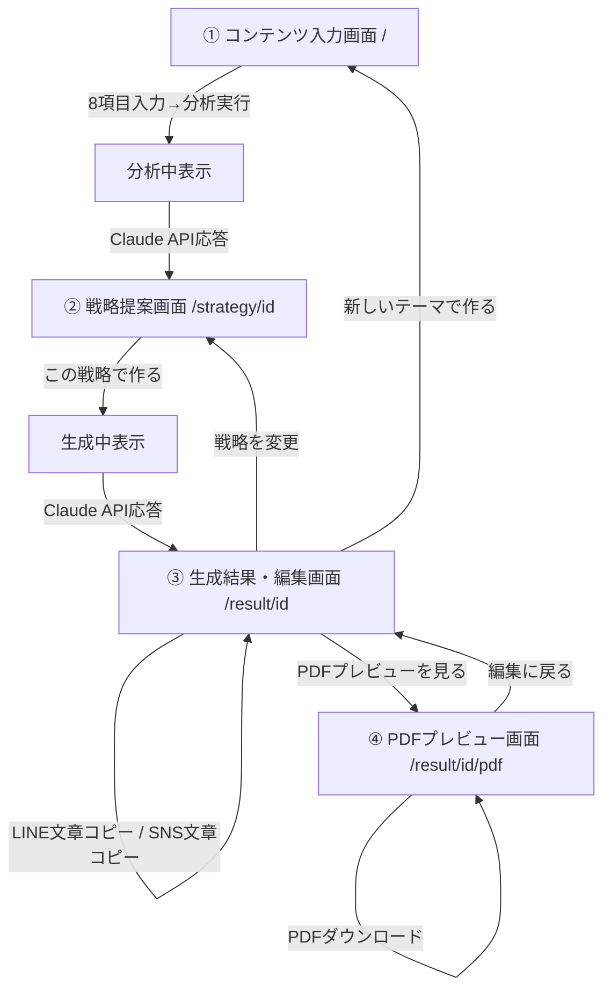

# マダナイ？ 特典コンテンツ作成ツール 設計書

> 「まだない？」を「もうある。」へ。
> マダナイのLINE登録特典と、その集客用コンテンツを効率よく作るための社内専用ツール。

**バージョン**: v0.2（MVPスコープ確定版・実装中）
**対象読者**: マダナイ社内（開発・運用）
**ステータス**: 承認済み → 実装フェーズ（STEP1〜6で段階実装）

---

## 変更履歴

- **v0.1**: 汎用AIマーケティングOS構想（複数組織/複数ブランド/権限管理/課金/20画面）として初版作成。
- **v0.2（本版）**: 社内で実際に使える最小構成に大幅縮小。今回作るのは汎用プラットフォームではなく、**「マダナイ専用の特典コンテンツ作成ツール」**。複数組織・複数ブランド・権限管理・課金・チーム機能・ログイン・Supabase・ダッシュボード・分析画面は今回すべて対象外。v0.1で検討した拡張構想は「11. 将来検討事項」に圧縮して記録するのみとする。

---

## 0. 目的とスコープ

**目的**: テーマ・ターゲット・特典の目的などを入力すると、AIが以下10項目を一括生成する。

1. 特典PDFのタイトル
2. 特典PDFの構成
3. 各ページの本文
4. チェックリストや診断項目
5. PDF内のCTA
6. LINEで特典を案内する文章
7. 特典送付時の文章
8. 特典送付後のフォロー文章
9. Threads投稿文（3案）
10. Instagram投稿文（1案）

**スコープ外（今回は作らない）**: 複数組織/複数ブランド管理、ログイン・権限管理、課金、チーム機能、ダッシュボード、成果分析、配信カレンダー、外部API自動配信（LINE/Instagram/Threads投稿の自動化）。ブランドは「マダナイ」1つに固定。生成履歴の保存先は当面ブラウザの`localStorage`のみ（DBなし）。

---

## 1. 画面一覧（v0.3で4画面に更新）

> STEP4cで「AIマーケティング分析・戦略提案画面」を追加した（v0.2時点は3画面のみだったが、
> 「文章生成の前にAIが戦略を比較検討して提案する」ことをこのツール最大の価値とするため、
> 生成の前段に戦略選択のステップを挟む構成へ変更した）。

| # | 画面 | 役割 |
|---|---|---|
| 1 | **コンテンツ入力画面** (`/`) | テーマ・ターゲット・悩み・目的など8項目を入力し、AIマーケティング分析を実行する |
| 2 | **戦略提案画面** (`/strategy/[id]`) | AIが分析した戦略候補（最低5件、うち1件はおすすめとして明示）を表示し、ユーザーが採用する戦略を選ぶ。生成済みコンテンツがある場合は「戦略を変更」の入口にもなる |
| 3 | **生成結果・編集画面** (`/result/[id]`) | 選択した戦略に沿って生成された10項目の結果を表示。セクション単位で編集・再生成、LINE/SNS文章のコピー、選択中戦略の確認・変更ができる |
| 4 | **PDFプレビュー画面** (`/result/[id]/pdf`) | 特典PDFのデザインをブラウザ上でプレビューし、ダウンロードする |

ダッシュボード、ブランド管理、チーム管理、分析画面などは作らない。生成履歴の一覧が必要になった場合も、まずは画面3の中に簡易リストを出す程度に留める。

---

## 2. 画面遷移



一本道のシンプルなフロー。サイドバーやグローバルナビは持たず、各画面の上部に「戻る」「次へ」の導線のみを置く。戦略候補（②）は分析のたびに再取得するのではなく、「戦略を変更」時は保存済みの候補一覧を再利用し、再分析はしない（入力を変更した場合のみ入力画面へ戻って分析し直す）。

---

## 3. データ構造

DBを持たないため、**TypeScriptの型定義**と**localStorageのスキーマ**がそのままデータ構造の仕様になる。

### 型定義（`lib/types.ts`）

```ts
export type ContentInput = {
  theme: string;          // コンテンツのテーマ
  target: string;         // ターゲット
  targetPain: string;     // ターゲットの悩み
  offerGoal: string;      // 特典の目的
  pageCount: number;      // ページ数
  tone: string;           // 文章の雰囲気
  desiredAction: string;  // 最終的に誘導したい行動
  supplementary?: string; // 補足情報
};

// PDFの各セクションは「①共感 → ②原因 → ③知識 → ④チェックリスト →
// ⑤自分だけでは難しいと感じるポイント → ⑥マダナイへの相談導線」の
// マーケティング品質順序をそのまま型として固定する。
export type PdfSectionType =
  | "cover"       // 表紙(タイトル)
  | "empathy"     // ①ターゲットの悩みへの共感
  | "cause"       // ②問題が起きている理由
  | "knowledge"   // ③解決に必要な知識
  | "checklist"   // ④実践できるチェックリスト/診断項目
  | "limitation"  // ⑤自分だけでは難しいと感じるポイント
  | "cta";        // ⑥マダナイへの自然な相談導線

export type PdfSection = {
  id: string;
  type: PdfSectionType;
  heading: string;
  body: string;
  items?: string[]; // type === "checklist" のときのみ使用
};

export type GeneratedContent = {
  id: string;
  createdAt: string;
  input: ContentInput;

  pdfTitle: string;           // 1. 特典PDFのタイトル
  pdfSections: PdfSection[];  // 2〜5. 構成・各ページ本文・チェックリスト・CTAをまとめて保持

  lineAnnouncement: string;   // 6. LINEで特典を案内する文章
  deliveryMessage: string;    // 7. 特典送付時の文章
  followUpMessage: string;    // 8. 特典送付後のフォロー文章

  threadsPosts: [string, string, string]; // 9. Threads投稿文3案
  instagramPost: string;                  // 10. Instagram投稿文1案
};
```

### localStorageスキーマ

```
key: "madanai:contents"
value: GeneratedContent[]   // 生成するたびに先頭に追加。上限は当面設けない（社内利用のため）
```

`/result/[id]`と`/result/[id]/pdf`は、このURLの`id`をキーに`localStorage`から該当データを読み出して描画する。DBやセッションを持たないため、**別ブラウザ/別端末では過去の生成結果を参照できない**（社内の個人利用が前提のMVPとして許容する）。

---

## 4. フォルダ構成

```
madanai-contentsAI/
├── app/
│   ├── layout.tsx
│   ├── globals.css
│   ├── page.tsx                     # ① 入力画面
│   ├── result/
│   │   └── [id]/
│   │       ├── page.tsx             # ② 生成結果・編集画面
│   │       └── pdf/
│   │           └── page.tsx         # ③ PDFプレビュー画面
│   └── api/
│       ├── generate/
│       │   └── route.ts             # Claude APIで10項目を一括生成 (STEP3)
│       ├── generate/section/
│       │   └── route.ts             # セクション単位の再生成 (STEP4)
│       └── pdf/
│           └── route.ts             # HTML→PDFレンダリング (STEP6)
├── components/
│   ├── input/
│   │   └── ContentInputForm.tsx     # 8項目の入力フォーム
│   ├── result/
│   │   ├── PdfSectionCard.tsx       # PDFセクションごとの編集カード＋再生成ボタン
│   │   ├── MessageCard.tsx          # LINE案内/送付/フォロー文言カード
│   │   ├── SocialPostCard.tsx       # Threads/Instagram投稿カード
│   │   └── CopyButton.tsx           # クリップボードコピー共通ボタン
│   └── pdf/
│       └── PdfDocument.tsx          # HTML/CSSのPDFテンプレート本体（プレビューと生成で共用）
├── lib/
│   ├── madanai-brand.ts             # マダナイの固定ブランド情報（1件だけ）
│   ├── types.ts                     # 3章の型定義
│   ├── storage.ts                   # localStorageの読み書きラッパー
│   └── ai/
│       ├── client.ts                # Anthropic SDKラッパー
│       ├── prompt.ts                # システムプロンプト構築（ブランド情報+品質ルール埋め込み）
│       └── schema.ts                # 構造化出力用のZodスキーマ
├── public/
│   └── madanai-logo.svg
├── docs/
│   └── DESIGN.md
├── package.json
├── tailwind.config.ts
├── tsconfig.json
└── README.md
```

v0.1にあった`packages/`のモノレポ構成、`apps/web`分割、`db/`(Prisma)、複数ブランド用の`brand`テーブル等はすべて不要のため廃止。単一のNext.jsアプリのみで完結させる。

---

## 5. 技術スタック

| レイヤー | 選定 | 理由 |
|---|---|---|
| フレームワーク | Next.js（App Router）+ TypeScript | フロントとAPI Routeを1つのプロジェクトで完結できる |
| スタイリング | Tailwind CSS | ブランドトークン（白背景・黒文字・ピンク〜紫グラデーション）を素早く適用できる |
| フォーム | React Hook Form + Zod | 8項目の入力バリデーションとClaudeの構造化出力スキーマを共用できる |
| AI | Anthropic Claude API（`@anthropic-ai/sdk`） | 日本語のトーン制御・構造化出力に強い |
| PDF生成 | Playwright（HTML/CSSテンプレート→PDF。当初案のPuppeteerから変更。理由は10章の進捗メモを参照） | 画像生成AIを使わず、CSSで完全にデザインをコントロールするため |
| データ保存 | ブラウザ`localStorage`のみ | DBなしでMVPを最速で動かすため。社内の個人利用が前提 |
| 認証 | なし | 社内限定・小規模利用のため今回は未実装 |
| ホスティング | 未確定（当面はローカル/社内ネットワークでの起動でも可） | 個人利用のMVPのため急いで決めない。必要になれば別途検討 |

Supabase・組織/権限管理・Stripe課金・チーム機能は明示的に**実装しない**。

---

## 6. コンポーネント設計

| コンポーネント | 役割 |
|---|---|
| `<ContentInputForm>` | 8項目の入力フォーム。送信時に`/api/generate`を呼び、結果画面へ遷移 |
| `<PdfSectionCard>` | PDFの1セクション（共感/原因/知識/チェックリスト/限界提示/CTA）を表示・編集。カードごとに「このセクションだけ再生成」ボタンを持つ |
| `<MessageCard>` | LINE案内文・送付時文・フォロー文をそれぞれ表示。編集欄＋コピー ボタン |
| `<SocialPostCard>` | Threads3案・Instagram1案を表示。案ごとにコピー ボタン |
| `<CopyButton>` | `navigator.clipboard`でテキストをコピーし、一時的に「コピーしました」を表示する共通ボタン |
| `<PdfDocument>` | `GeneratedContent`を受け取り、マダナイブランドのHTML/CSSレイアウトに変換するプレゼンテーショナルコンポーネント。プレビュー画面で使用する。PDFレンダリング(Playwrightが読み込むHTML)側は、Next.jsのapp/配下から`react-dom/server`を静的importできない制約のため、同じCSS/ラベルロジックを使うプレーンな文字列テンプレート(`lib/pdf/render-html.ts`)で別途生成する |

「10項目バラバラの画面」ではなく、**PDF編集エリア（6カード）＋メッセージ編集エリア（3カード）＋SNSエリア（2カード）**という3ブロック構成で結果画面をまとめ、Notionのブロック編集のような一覧性を持たせる。

---

## 7. Claude API設計

### ブランドコンテキストの埋め込み

複数ブランドを切り替える必要がないため、v0.1にあった「ブランドキャッシュ層」は不要。`lib/madanai-brand.ts`の固定情報を**毎回そのままシステムプロンプトに埋め込む**だけでよい。

```ts
// lib/madanai-brand.ts（イメージ）
export const MADANAI_BRAND = {
  name: "マダナイ？",
  concept: "「まだない？」を「もうある。」へ。",
  positioning:
    "ホームページ制作会社ではなく、AIとWEBで集客・売上・業務効率化まで支援する会社",
  toneGuideline:
    "専門的だが親しみやすい。断定しすぎず、読者の次の一歩を軽くする。煽らない。",
  ngExpressions: [
    "絶対に",
    "誰でも簡単に稼げる",
    "必ず成果が出ます",
    "業界最安",
    "今だけ", // 根拠のない緊急性の演出
  ],
  consultationCta:
    "ここまで読んでくれたということは、本気で変えたいと思っているはず。マダナイに、無料で話してみませんか？",
};
```

### システムプロンプトの構成（レイヤー）

```
Layer 1: 人格層（固定）
  「あなたはマダナイのマーケティング担当者。中小企業・個人事業主向けの
   LINE登録特典コンテンツを作成する。単なる文章生成ではなく、読者の
   行動変容と最終的な相談・契約に責任を持つ。」

Layer 2: マダナイのブランド情報（MADANAI_BRAND、固定）

Layer 3: ユーザー入力（ContentInput：テーマ/ターゲット/悩み/目的/ページ数/雰囲気/誘導したい行動/補足）

Layer 4: マーケティング品質ルール（固定・最重要）
  PDF本文は必ず以下の順で構成すること：
  ①ターゲットの悩みへの共感 → ②問題が起きている理由 →
  ③解決に必要な知識 → ④実践できるチェックリスト →
  ⑤自分だけでは難しいと感じるポイント → ⑥マダナイへの自然な相談導線
  煽り表現・根拠のない成果保証・誇大表現は禁止（ngExpressionsを禁則語として明示）。

Layer 5: 出力フォーマット層
  Zodスキーマに基づくtool useで、GeneratedContentの入力部分を除いた
  JSON（pdfTitle, pdfSections, lineAnnouncement, deliveryMessage,
  followUpMessage, threadsPosts, instagramPost）を強制する。
  pdfSectionsは type の並び順を
  cover → empathy → cause → knowledge → checklist → limitation → cta
  に固定する（品質ルールを構造として強制する）。
```

### 生成エンドポイント

- `POST /api/generate`：入力フォームの内容から`GeneratedContent`全体を1回で生成する（STEP3）。
- `POST /api/generate/section`：既存の`GeneratedContent`のうち、指定した1セクション（例: `checklist`のみ、`instagramPost`のみ）だけを、他セクションとの整合性を保ちながら再生成する（STEP4）。ブランド情報とユーザー入力に加え、**再生成対象以外の既存セクション**もコンテキストとして渡し、トーンや文脈がズレないようにする。

### 簡易チェック

生成直後に`ngExpressions`との単純な文字列マッチで禁止表現が混入していないかチェックし、混入していれば自動的に1回だけ再生成をリトライする（軽量なポストチェック。複雑な検証パイプラインは作らない）。

### モデル選定

- 現行のClaude Sonnet系（例: `claude-sonnet-4-5`）を標準モデルとして使用する。個人利用規模のMVPのため、モデルの出し分け（戦略用/生成用で分ける等）は行わない。

---

## 8. PDF生成方法

- **方式**: HTML/CSSテンプレート（`components/pdf/PdfDocument.tsx`と同じCSSを使う`lib/pdf/render-html.ts`）をPlaywrightでPDF化する。画像生成AIは使わない。
- **テンプレート数**: 最初は**1種類のみ**。
- **判型**: A4縦。
- **デザイン仕様**:
  - 白背景・黒文字
  - ピンク→紫のグラデーションは、見出し帯・チェックリストのアイコン・CTAブロックなど「アクセント」にのみ使用（全面塗りはしない）
  - 余白を広く取る（Apple的な余白感）
  - 日本語本文は読みやすい行間・フォントサイズ（16px相当以上、行間1.8前後）
  - 表紙・各ページヘッダーにマダナイのロゴを配置
  - AI感（無機質な配色・テンプレ感の強いアイコン多用）を避け、手触りのあるデザインにする
- **プレビュー**: `/result/[id]/pdf`では`<PdfDocument>`をそのままブラウザ表示し、スマートフォンでも内容確認できるようレスポンシブ対応する（PDF自体はA4固定だが、プレビュー用のWeb表示は画面幅に応じて崩れないようにする）。
- **ダウンロード**: プレビュー画面の「PDFダウンロード」ボタンから`/api/pdf`にPOSTし、サーバー側でPlaywrightが同じレイアウトのHTMLをA4サイズでレンダリングしてPDFバイナリを返す。

---

## 9. マダナイのブランド情報の管理方法

複数ブランドを管理するデータモデルは不要なため、v0.1の「ブランドブック」構想を大幅に簡略化し、**`lib/madanai-brand.ts`に固定値としてハードコードする**。

含める情報:
- サービス名・コンセプト・ポジショニング
- トーン方針（1〜2文）
- NG表現リスト
- 相談導線の定型文（PDF内CTA・LINE誘導などで使い回す）
- ロゴファイルのパス、ブランドカラー（Tailwind設定と連動）

ブランド情報を変更したい場合は、このファイルを直接編集する運用とする（設定画面は作らない）。将来複数ブランドが必要になった場合は、このファイルをテーブル化する形で拡張できる設計にはしておくが、今回は実装しない。

---

## 10. 開発ステップ

各STEP完了時に、実装内容・変更ファイル一覧・ブラウザでの確認方法・残っている課題・次に実装する内容を報告する。

| STEP | 内容 |
|---|---|
| STEP1 | Next.js初期構築、入力画面（8項目フォーム）の作成 |
| STEP2 | 固定データ（モック）を使った生成結果画面の作成 |
| STEP3 | Claude APIとの接続（`/api/generate`） |
| STEP4 | セクション編集・再生成・コピー機能 |
| STEP5 | HTML/CSSによるPDFテンプレート作成（1種類） |
| STEP6 | PDFプレビュー・ダウンロード（`/api/pdf`） |

**進捗メモ（実装時の変更点）**:
- STEP3の実通信確認（実際のAPIキーでClaude APIを叩く検証）はAPIキー未取得のため保留中。API接続コード自体はSTEP3で実装済み。
- APIキー待ちの間、API不要なSTEP5・STEP6（PDFテンプレート・プレビュー・ダウンロード）を先に実装した。
- PDF生成ライブラリはPuppeteerからPlaywrightに変更した（開発環境にPlaywright用Chromiumがプリインストールされていたため。機能的な違いはない）。
- **STEP4c（AIマーケティング分析・戦略提案機能）を追加**: 本ツールを単なる文章生成ツールではなく「マダナイ専属のAIマーケティング担当者」として設計するため、`入力 → AIマーケティング分析 → 戦略候補の提案(最低5件) → ユーザーが戦略を選択 → コンテンツ生成`という流れへ変更した。新規画面`/strategy/[id]`を追加し、`GeneratedContent`に`selectedStrategy`フィールドを追加、戦略候補一覧は`StrategyAnalysis`として別のlocalStorageキー（`madanai:strategy-analyses`）に保存する。詳細はREADMEの「AIマーケティング分析・戦略提案機能」を参照。
- PDFのReact画面/HTML文字列テンプレートの二重管理を軽減するため、`lib/pdf/section-render-model.ts`（`buildSectionRenderModel`）でセクション種別ごとの表示判断を共通化した（README「PDFアーキテクチャの選択」参照）。

---

## 11. 将来検討事項（今回は実装しない・Appendix）

v0.1で検討していた拡張構想を要点のみ残す。優先度をつけて着手するのは、このMVPが実際に社内で使われ、価値が確認できてから。

- 複数ブランド/複数組織対応（エージェンシー型 or 他社へのSaaS展開）
- ログイン・チーム機能・権限管理
- 課金（Stripe等）
- 生成履歴のDB化（Supabase/PostgreSQL等）、複数端末での共有
- LP構成、メルマガ、営業資料、画像生成プロンプトなど対応チャネルの拡張
- LINE公式アカウント/Instagram/ThreadsのAPI連携による自動配信
- **PDFレンダリングの子プロセス方式（B案）**: 現在はブラウザプレビュー用のReactコンポーネント(`components/pdf/PdfDocument.tsx`)と、PDFダウンロード用のHTML文字列テンプレート(`lib/pdf/render-html.ts`)を、共通の正規化ロジック(`buildSectionRenderModel`)を介して二重管理している（Next.js App Routerが`app/`配下から`react-dom/server`の静的importを許可しないため）。将来PDFデザインの変更頻度が高くなった場合は、`/api/pdf`から`child_process`で別のNode実行ファイルを起動し、そちらで`PdfDocument.tsx`を`react-dom/server`でそのままレンダリングする方式（完全な単一ソース化）へ移行する選択肢がある。今回は別プロセス起動のレイテンシ・TSXビルドの仕組み・デバッグの複雑化という運用コストが見合わないため採用していない。
- 戦略の切り口をLP・広告・YouTube・Instagramリール・営業資料・LINEステップなど他チャネルの生成にも引き継ぐ（`StrategyCandidate`はチャネル非依存の設計にしているため、各チャネルの生成器を`generate(input, selectedStrategy)`という同じ形の呼び出しで拡張できる想定）
- 成果分析ダッシュボード（開封率/CTR等）、A/Bテスト
- PDFテンプレートの複数化・テンプレート選択機能
